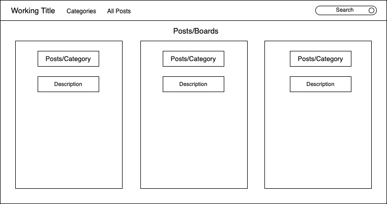
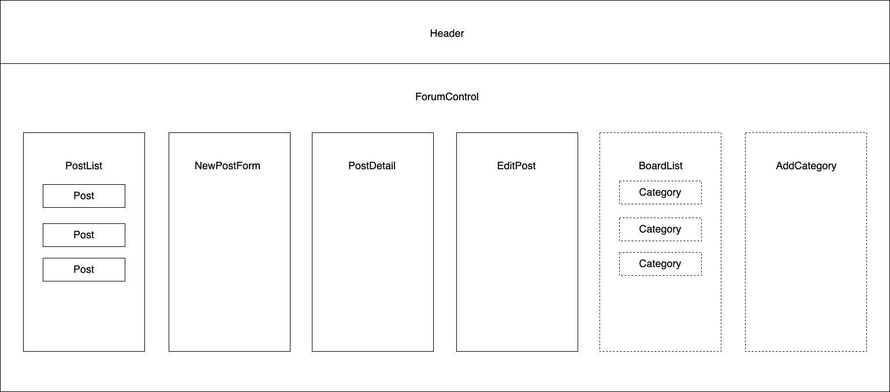

# <h1 align = "center"> Reddit Clone

## <h3 align = "center"> Single Page React Web Application

## <h2 align = "center"> About

 

## <h2 align = "center"> Initial App Mockup

## **✅REQUIREMENTS**
* Install [Visual Studio Code](https://code.visualstudio.com/)

## **💻SETUP**
* to clone this content, copy the url provided by the 'clone or download' button in GitHub
* in command line use the command 'git clone (https://github.com/Scott-Ian/KombuchaKafe.git)'
* open the program in a code editor
* in the command/termminal line enter the command "npm start" to run the program
* if the project does not open on its own, in your preferred web-browser navigate to: localhost: 3000
__

## User Stories

* As a user, I want to create new categories.
* As a user, I want to view posts in a category.
* As a user, I want to enter content into a form and submit to create a new post.
* As a user, I want my new posts to include a timestamp. And I want to see when other listings were posted, too.
* As a user, I want to upvote posts I particularly enjoy.
* As a user, I want to downvote posts I don't like, or find inappropriate.
* As a user, I'd like posts with the most upvotes to appear higher on the page.

## <h2 align = "center"> Component Mockup

## Known Bugs

_Bugs? We don't have any Bugs!_

## Support and contact details

Contact : Ian Scott

## Technologies Used

* JS
* React

## **📘 License**
